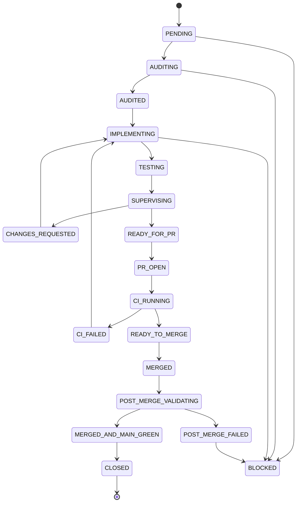

# Máquina de estados de cada bloque

Cada bloque recorre exactamente estos estados:

```text
PENDING
AUDITING
AUDITED
IMPLEMENTING
TESTING
SUPERVISING
CHANGES_REQUESTED
READY_FOR_PR
PR_OPEN
CI_RUNNING
CI_FAILED
READY_TO_MERGE
MERGED
POST_MERGE_VALIDATING
POST_MERGE_FAILED
MERGED_AND_MAIN_GREEN
CLOSED
BLOCKED
```

## Transiciones permitidas

```text
PENDING            → AUDITING
AUDITING           → AUDITED
AUDITED            → IMPLEMENTING
IMPLEMENTING       → TESTING
TESTING            → SUPERVISING
SUPERVISING        → CHANGES_REQUESTED
CHANGES_REQUESTED  → IMPLEMENTING
SUPERVISING        → READY_FOR_PR
READY_FOR_PR       → PR_OPEN
PR_OPEN            → CI_RUNNING
CI_RUNNING         → CI_FAILED
CI_FAILED          → IMPLEMENTING
CI_RUNNING         → READY_TO_MERGE
READY_TO_MERGE     → MERGED
MERGED             → POST_MERGE_VALIDATING
POST_MERGE_VALIDATING → POST_MERGE_FAILED
POST_MERGE_FAILED  → (bloque de corrección / HOTFIX_BLOCK_N)
POST_MERGE_VALIDATING → MERGED_AND_MAIN_GREEN
MERGED_AND_MAIN_GREEN → CLOSED
```

`BLOCKED` es alcanzable ante una dependencia externa ausente (p. ej. endpoint o secreto) o un
hallazgo de seguridad/producción. El diagrama de abajo dibuja los puntos de entrada
representativos a `BLOCKED` (`PENDING`, `AUDITING`, `IMPLEMENTING`, `POST_MERGE_FAILED`); la
regla normativa permite entrar en `BLOCKED` desde cualquier estado si se materializa uno de esos
disparadores.

## Transiciones prohibidas

```text
AUDITED         → MERGED
TESTING         → READY_TO_MERGE
SUPERVISING     → MERGED
CI_FAILED       → READY_TO_MERGE
MERGED          → (siguiente bloque, sin validación post-merge)
POST_MERGE_FAILED → (siguiente bloque)
```

## Diagrama


