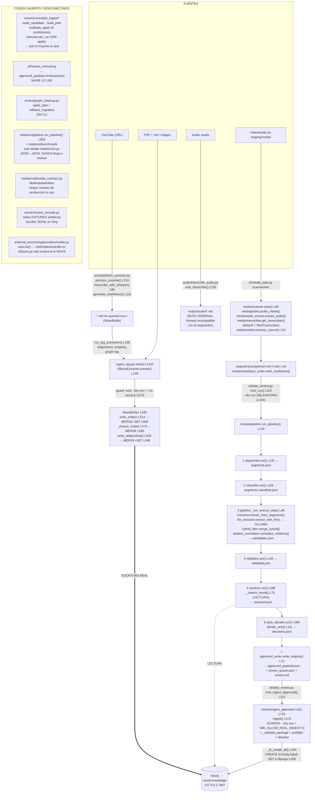

# 00 — Auditoría previa del sistema actual (S9-Knowledge V3, fase 5)

**Fecha de la auditoría:** 2026-07-27
**Rama:** `feat/knowledge-v3-redesign` · **Base:** `1553665`
**Ámbito de trabajo:** worktree `.claude/worktrees/v3-audit`. No se ha tocado `main` ni el
checkout principal.
**Naturaleza de las comprobaciones en vivo:** **estrictamente de solo lectura**. No se ha
escrito en Neo4j, no se ha desplegado nada, no se ha reiniciado ningún servicio, no se ha
modificado ningún fichero en VM105. Todas las órdenes remotas fueron `systemctl status/cat`,
`journalctl`, `docker ps`, `ls`, `cat`, `curl` y `cypher-shell` con consultas `MATCH … RETURN
count(…)`.

> **Ajuste explícito del operador:** *no se reproducen métricas ni benchmarks.* Ya se
> midieron y están documentados. Las cifras de este informe se **citan** con su fuente
> archivada. Las **identificaciones sobre el código** y las **verificaciones en vivo** sí se
> han realizado de verdad para esta auditoría.

---

## 1. Resumen ejecutivo

1. **El punto de partida que fija el PR #106 es demoledor y hay que aceptarlo tal cual:** la
   cadena completa (extractor real → motor) extrae **una relación de 52** con el predicado
   correcto sobre material real, entre unos **170 falsos positivos**. El motor aislado mide
   `predicate 0.8140` en el corpus con el que se desarrolló y **0.2391** en material real; el
   rango «honesto» `[0.42, 0.81]` que se venía citando **no contiene la realidad**.

2. **No existe una única ruta de ingesta: existen dos, y no se tocan.** Un **camino A legacy**
   (`ingest_rpg.py`) que escribe de verdad en Neo4j con `MERGE`+`SET` y solo dos flags de CLI
   como protección, y un **camino B de revisión** (`cli/data_review.py` → `review/*` →
   `ingest_approved.py`) con cinco capas de guard pero `CREATE`-only. **La ruta más peligrosa
   es la menos protegida**, y es alcanzable automáticamente desde YouTube
   (`fetch_youtube.run_rpg_extraction` lanza `property-graph-rpg` por subproceso).

3. **La «ingesta controlada» sobre el contrato v1 no está cableada a nada.** Todo
   `review/controlled_ingest/` — incluido el gate de 9 condiciones de `policy.evaluate_apply`
   — sólo lo importa su propio test. No hay ejecutor de `APPLY`: `executor.py` únicamente
   implementa `dry_run()` y `blocked_result()`.

4. **La revisión humana no desemboca en ingesta.** `cli/review_manual.py` produce
   `approved_payload.reviewed.json`, que **nadie lee**; `ingest_approved.run()` consume el
   `approved_payload.json` automático, cuyo `review_status="auto_approved"` es rechazado
   precisamente bajo `S9K_REVIEW_POLICY=full_human_review`. La única combinación que escribe
   es la que **omite** las validaciones de procedencia humana.

5. **Producción está intacta y así se ha verificado.** VM105 sirve la release
   `deploy-v0.3.0-rc5.1` (`47bc314`), Neo4j Community 5.26.0 con **199 nodos / 140
   relaciones** (idéntico al baseline histórico de docs/24), un único workspace `leyenda`, el
   visor activo tras autenticación y el timer horario de healthcheck en marcha. El único
   `[ERR]` del healthcheck es un **backup rancio (232,6 h > 48 h)**: nada relacionado con
   ingesta ni con el grafo.

6. **Ollama responde y NVIDIA está configurada, pero ninguna de las dos está enganchada al
   servicio.** `qwen2.5:7b` contesta HTTP 200 en `192.168.1.157:11434`, y sin embargo el
   healthcheck reporta `ollama: no configurado` porque no hay ninguna variable `S9K_OLLAMA_*`
   en `/etc/s9-knowledge/`. La clave de NVIDIA existe y `S9K_NVIDIA_ENABLED=true`, pero vive
   en `nvidia.env`, que **ninguna unidad systemd carga**.

7. **Para V3 hay mucho más aprovechable de lo que sugiere el titular.** El localizador de
   pares, el anclaje literal de evidencia, la ontología con dominio/rango, el arnés, los
   contratos y las garantías de la capa externa son sólidos. Lo que no sirve es el
   clasificador léxico de predicado, y lo que falta por completo es todo el tramo multimodal
   más allá de ASR.

**Dictamen de la auditoría:** el estado real del sistema es **peor de lo que el dosier V3 da
por supuesto en su §4.2 «componentes reutilizables»** (varios de esos componentes son código
muerto), y **mejor de lo que sugiere el titular del PR #106** en lo que respecta a
infraestructura, contratos y garantías. V3 puede empezar, pero debe hacerlo sabiendo que
«writer controlado», «consola de revisión» y «dispatcher externo» hoy **no procesan nada
real**.

---

## 2. Punto de partida establecido por el PR #106

**PR:** `pjclavero/S9-Knowledge#106` — *«docs: informe de desarrollo del motor de relaciones y
guía de rediseño»*. Estado: **OPEN**, 478 adiciones, 0 supresiones. Toca **un único fichero**:
`docs/MOTOR_RELACIONES_INFORME_DESARROLLO_Y_REDISENO.md`. No modifica código, contratos,
arnés ni umbrales.

Lo que el PR establece como punto de partida:

| Lo que fija | Contenido |
|---|---|
| **La cifra central** | `predicate_correct`: **0.8140** (B1, dev==test, n=54) → **0.5385** (H1, held-out sintético) → **0.2391** (H2, material real). De la ganancia v1→v2 de `+0.6047` sobrevive el **7 %**. |
| **Tres invalidaciones** | (a) la **dirección regresa** en material real: v2 `0.6957` < v1 `0.7609`; (b) «0 falsos ACCEPT» era propiedad del corpus, no del motor (aparecen **2**); (c) aparecen **4 falsos RECHAZOS**, peor que abstenerse porque destruyen información correcta. |
| **La causa raíz** | El clasificador es **léxico, no semántico**. Una ablación ya había mostrado que ~70 % de la ganancia inicial venía de expresiones calcadas del corpus. En material real sólo sobreviven `MEMBER_OF` y `LOCATED_IN`; **9 de 14 familias sacan cero**; **41 %** de las salidas es el comodín `RELATED_TO`; abstención del **100 %** (0 resultados `strong` de 64). |
| **La medición nueva (§10)** | La **cadena completa**, nunca antes medida: con entidades reales, H2 cae a `pair_F1 0.0333 · predicado 0.0000 · strict 0.0000` (ids estrictos) y `0.1610 · 0.0526 · 0.0085` (ids laxos). Descomposición: `0.442 (extractor) × 0.826 (pares) × 0.0526 (predicado) = 0.0192`. **Arreglar sólo uno de los dos no sirve.** |
| **Hallazgo sobre el arnés** | El arnés emitió *«APTO CON REVISIÓN DE CASOS CONFLICTIVOS»* para una corrida con `pair_F1 = 0.0611`: **no existe gate sobre `global_existence`** y las tasas estructurales se calculan sólo sobre verdaderos positivos. `types_correct = 1.0000` era **tautológico**. |
| **La costura para el rediseño** | `relation-candidate/internal-v1` (20 campos) es la **única** frontera que consume el resto del sistema. Superficie mínima para un motor nuevo: **un módulo nuevo + una rama en `_build_candidate`** tras un valor nuevo del flag `predicate_selector` (`v1` sigue siendo el default y la vía de rollback). |
| **Los 7 invariantes innegociables** | Dry-run estructural sin flag que lo desactive · la IA externa propone y nunca decide · evidencia literal con offsets puestos por el sistema · fail-closed · determinismo · aislamiento por workspace · sin secretos en artefactos ni logs. |
| **Lección metodológica** | *«Un test verde sólo vale si puede ponerse rojo.»* Tres casos documentados de gates verdes que no ejercitaban la ruta real; sólo las pruebas de mutación los destaparon. |
| **Estado declarado** | `main` contiene el motor v2 **fusionado y NO activado** (`predicate_selector="v1"`). **Producción intacta, sin ingesta, sin escritura en Neo4j.** El material real (libros con copyright y grabaciones con datos personales) **no está en el repositorio y no debe estarlo**. |

---

## 3. Diagrama REAL de la cadena actual

Con ficheros y funciones verificados en el código de esta rama.



**Lectura del diagrama:** las dos flechas gruesas hacia Neo4j son las únicas escrituras vivas.
Todo el bloque «huérfanos» es código implementado, probado y **sin consumidor**.

---

## 4. Identificaciones sobre el código real

### 4.1. La ruta real de ingesta de extremo a extremo

Existen **dos caminos independientes** que no se invocan mutuamente.

#### Camino A — legacy `ingest_rpg.py` (el que realmente muta el grafo hoy)

```
property-graph-rpg  ==  data-engine/app/ingest_rpg.py:1929
  → parse_args() L1083 → main() L1142
      → load_config() L48 · extract_text_by_page() L86 · chunk_pages() L120
      → OllamaExtractor.extract() L149 / extract_events_and_relations() L207
      → [GUARD L1270] if not --no-neo4j and not --dry-run:
            → Neo4jWriter.__init__() L433  (GraphDatabase.driver L442)
      → writer.set_doc_context() L450
      → writer.write_entity() L514         (llamadas en L1387, L1674)
      → writer.write_relationship() L626   (llamadas en L1698, L1784)
      → writer.close() L721
```

Alimentador automático: `youtube/fetch_youtube.py:process_youtube() L210` →
`run_rpg_extraction() L196` lanza `subprocess.run(["property-graph-rpg", …])`. **Es el único
punto donde una fuente externa llega a Neo4j automáticamente, y se salta por completo el
pipeline de revisión.**

#### Camino B — pipeline de revisión (el diseñado, con guards)

Tramo 1, multimedia → markdown (`cli/media_jobs.py:main() L165`):

```
cmd_scan() L75  → media/scanner.scan() L65 → iter_candidate_files() L49
                → media/probe.probe_media() → MediaJobStore.save()
cmd_worker() L99 → media/worker.run_worker() L117 → process_source() L52
                → media/audio_extract.extract_audio()
                → media/transcriber.get_transcriber()  ← default "stub"
                → media/markdown_writer.write_markdown()
                ⇒ output/transcriptions/<workspace>/<source_id>.md
```

Tramo 2, markdown → decisiones (`cli/data_review.py:cmd_run() L102`, `--dry-run` obligatorio
en L104):

```
review/pipeline.run_pipeline() L143
  1 segmenter.run() L132            → segments.json
  2 classifier.run() L163           → segments.classified.json
  3 pipeline._run_extract_step() L48 → candidates.json
       extractor.extract_from_segments() · llm_extractor.extract_with_llm()
       hybrid_filter.merge_hybrid() · relation_normalizer.normalize_relations()
  4 validator.run() L148            → validated.json
  5 resolver.run() L298             → resolved.json     [Neo4j LECTURA]
  6 auto_decider.run() L389         → decisions.json
  7 approved_writer.write_outputs() L72 → approved_payload.json, review_queue.json, review.md
  (cada paso) review_store.ReviewStore.save_step() L49 → pipeline_state.json + state/reviews.db
```

Tramo 3, escritura controlada (`cli/data_review.py:cmd_ingest_approved() L131`):

```
review/ingest_approved.run() L755 → ingest() L473
   → _compute_payload_sha256() L422 · _validate_package() L115
   → _neo4j_preflight() L276 (lectura, con _assert_readonly_query L84)
   → session.execute_write(_tx_create_all) L650
        → tx.run("CREATE (n:Entity:`{label}`) SET n = $props") L328
```

#### Tramos desconectados o huérfanos (hallazgo)

| Ref | Elemento | Situación |
|---|---|---|
| F1 | `review/controlled_ingest/*` | **Huérfano total.** Único importador: `data-engine/app/tests/test_controlled_ingest_policy.py`. `policy.evaluate_apply()` L45 (gate de 9 condiciones) no protege nada. `executor.py` sólo tiene `dry_run()` L31 y `blocked_result()` L88: **no existe ejecutor de APPLY**. |
| F2 | Auditoría/idempotencia de `ingest_approved` | **Inactivas por el CLI.** `run()` L755 llama a `ingest()` sin `audit_log_path` ni `operator`; todos los bloques de auditoría están bajo `if audit_log_path is not None:` (L525, L626, L661, L682). No se escribe `ingest_audit_log.jsonl` ni se comprueba `ALREADY_APPLIED`. |
| F3 | Funciones muertas en `ingest_approved.py` | `_validate_candidate_fields_b2` L195 (**los campos B2 no se validan en el flujo real**), `_build_match_use_existing_query` L333, `_build_merge_relation_query` L358, `build_rollback_cypher` L706, `build_rollback_count_cypher` L724 — **no hay CLI de rollback**. |
| F4 | `review/graph_cleanup.py` | `plan_cleanup` L327, `apply_plan` L359, `rollback_migration` L418 **sin CLI**; sólo tests y una doc que instruye ejecutarlos a mano desde un REPL. |
| F5 | `relations/*` | **Desconectado del pipeline de revisión.** `relations/pipeline.run_pipeline()` L855 sólo se invoca desde `relations/cli.py:main()` L69 (JSON→JSON). `review/` no importa `relations/` en ningún punto. Sus candidatos **nunca llegan** a `candidates.json` ni a Neo4j. |
| F6/F7 | `ingest_code.py`, `import_graphify.py` | Stubs: «procesamiento/importación real no implementada todavía». Cero Neo4j. |
| F8 | `audio/transcribe_audio.py` | Terminal. Escribe a `output/audio/`, pero `segmenter.segment_transcript()` L63 sólo busca `output/transcriptions/<ws>/<sid>.md`. |
| F9 | `youtube/fetch_youtube.py` | `generate_markdown()` L116 no emite `- Source ID:` / `- Source kind:` / `- Workspace:` (que `segmenter._detect_metadata` L39 exige) ni timestamps `[HH:MM:SS]` (que `segmenter.TS_RE` L24 exige). **Incompatible con el pipeline de revisión**; su única salida al grafo es el camino A. |
| F10 | `cli/review_manual.py` | Produce `approved_payload.reviewed.json` L138; **nadie lo lee** (verificado por grep). `ingest_approved.run()` L762 lee `approved_payload.json`, cuyo `review_status="auto_approved"` es rechazado por `_validate_write_provenance` L233 bajo `full_human_review`. **La revisión humana no tiene salida a Neo4j.** |
| F11 | `viewer/app/routers/readonly.py` | `_WRITE_TOKENS_RE` L71-74: regex de bloqueo de tokens Cypher **definida y nunca usada**. Guard inerte. |
| F12 | Residuos en el árbol | 7 ficheros `data-engine/app/ingest_rpg.py.bak*` (contienen `Neo4jWriter` con escrituras) y 5 `data-engine/app/schemas/rpg_schema.py.bak*`. |
| F13 | `jobs/worker.py` | Sólo `handle_noop` L40 y `handle_echo` L45. La cola SQLite **no ejecuta ingesta**. |

### 4.2. Todos los puntos de escritura directa a Neo4j

**Escrituras** (mutan el grafo):

| # | Fichero · función · línea | Operación | Guard |
|---|---|---|---|
| **W1** | `data-engine/app/ingest_rpg.py` · `Neo4jWriter.write_entity` L514 · `session.run` L564 | `MERGE (n:Entity:{label} {…}) ON CREATE SET … SET <17 props>` (L555-558) | **Sólo** `--dry-run` / `--no-neo4j` (L1270). **Sin guard de entorno.** |
| **W2** | ídem · `Neo4jWriter._ensure_node` L570 · query L585 | `MERGE (n:Entity:Concept {…}) ON CREATE SET … SET …` — **crea nodos destino automáticamente** | ídem W1 |
| **W3** | ídem · `Neo4jWriter.write_relationship` L626 · `session.run` L698 | `MATCH … MATCH … MERGE (a)-[r:{rel_type}]->(b) ON CREATE SET … SET …` · ⚠ `rel_type` **interpolado por f-string** (L690) sin allowlist en el punto de interpolación | ídem W1 |
| **W4** | `data-engine/app/review/ingest_approved.py` · `_tx_create_all` L304 · `tx.run` L328 | ``CREATE (n:Entity:`{label}`) SET n = $props`` | **Cinco capas:** `--dry-run` obligatorio + `S9K_ALLOW_REAL_INGEST=true` ×3 (L133, L502, L757) + `_validate_package` + preflight `safe` (L646) + allowlist `_ALLOWED_LABELS` L175 + `execute_write` atómico con reverificación anti-TOCTOU (L312, L318) |
| **W5** | `data-engine/app/review/graph_cleanup.py` · `apply_plan` L359 · `session.run` L404 | `SET n.source_id, n.source_kind, n._mig` | `apply=True` + `S9K_ALLOW_GRAPH_MIGRATION=true` (L354/L392) + `backup_ref` no vacío (L396); sólo items `AUTO_SAFE`. **Huérfano (F4).** |
| **W6** | ídem · `rollback_migration` L418 · `session.run` L437 | `REMOVE n.source_id, n.source_kind, n._mig` | ídem W5. Huérfano. |
| **W7** | ídem · `_plan_bad_relations` L237 (cadenas L257-259, L285) | **Genera** `CREATE … DELETE r` | **Nunca ejecutadas**: clasificadas `REVIEW_REMAP`/`REVIEW_REQUIRED`; `apply_plan` sólo itera `plan.auto_items` L381 |
| **W8** | `ingest_approved.py` · `_build_merge_relation_query` L358 | `MERGE (a)-[r:{rel_type}]->(b) SET r += $props` | **Código muerto**; además `allow_relationships=False` por defecto (L479, L564) |
| **W9** | `ingest_approved.py` · `build_rollback_cypher` L706 | `MATCH (n {ingest_batch_id:$id}) DETACH DELETE n` | Sólo construye la cadena; **nadie la ejecuta** |
| **W10** | `scripts/backup/neo4j-restore.sh` L113 | `neo4j-admin database load --overwrite-destination=true` — **destructivo a nivel de base** | `--dry-run` (L39, rama L91) |
| **W11** | `scripts/backup/neo4j-backup.sh` L104-113 | `docker stop` + `neo4j-admin database dump` (no muta el grafo, pero **para el contenedor**) | `--dry-run` (L88) |

No existe ningún otro `MERGE` / `CREATE (` / `SET n.` / `DELETE` sobre Cypher en el
repositorio.

**Lecturas** (solo lectura, verificadas): `review/resolver.py` (`_get_neo4j_driver` L62,
`_search_neo4j` L76) · `review/ingest_approved.py` (`_count_by_name` L268, `_neo4j_preflight`
L276) · `review/audit_graph.py` (9 buscadores, 100 % lectura, expuesto por
`data_review.py audit-graph`) · `review/graph_cleanup.py` (planificación) ·
`glossary/glossary_extractors.py` (`Neo4jGlossaryExtractor.extract` L245, sólo con
`--from-neo4j`) · `tools/audit_duplicates.py` (`_fetch_nodes` L147) ·
`viewer/app/providers/neo4j_provider.py` (**13 métodos, todos `MATCH … RETURN`, ni una
cláusula de escritura**; activo sólo si `S9K_GRAPH_PROVIDER="neo4j"`, default `"mock"`) ·
`viewer/app/health/checks.py` (`check_neo4j` L84) · `scripts/backup/neo4j-rollback-dryrun.sh`.

**Quién puede escribir, en una frase:** hoy sólo dos módulos —`ingest_rpg.py` (sin llave de
entorno) y `ingest_approved.py` (con triple llave)—, más dos scripts de backup/restore y un
módulo de migración sin CLI. **El visor no puede escribir en ningún caso.**

### 4.3. Contratos existentes y sus versiones

| Contrato | Ubicación | Versión declarada | Notas |
|---|---|---|---|
| **review-ingest v1** (6 documentos JSON Schema draft 2020-12 + `_common`) | `contracts/review-ingest/v1/` | `$id` `https://s9-knowledge/contracts/review-ingest/v1/…`; versión por instancia en `schema_version` (`1.x.y`); `SUPPORTED_MAJOR = 1` en `validator.py` | `review-candidate` (29 props/27 req), `review-decision` (23/20), `review-source-summary` (27/25), `ingest-plan` (25/24), `ingest-plan-result` (22/18), `review-audit-event` (20/15). `validator.py` expone `build_registry`, `schema_for`, `validate_document`, `is_valid`; añade checks semánticos (unicidad de `operation_id`/`idempotency_key`, APPLY `PARTIAL` sin rollback, secretos en `metadata`). 11 ejemplos válidos + 15 inválidos. |
| **`relation-candidate/internal-v1`** | `data-engine/app/relations/contracts.py` | **`SCHEMA_VERSION = "internal-1.0.0"`** (L50), `DOCUMENT_TYPE = "relation-candidate"` | Dataclass `RelationCandidate` con **exactamente 20 campos**. Contrato **cerrado**: campo desconocido en `from_dict` → `RelationContractError` (L309). Enums `Direction`, `ExtractionMethod`, `EpistemicStatus`. **Es la frontera que el PR #106 declara intocable.** |
| **`multimedia-artifact/internal-v1`** | `data-engine/app/media/multimedia_contract.py` | **`CONTRACT_ID = "multimedia-artifact/internal-v1"`** (L40) | `MediaType` con **10 tipos** (EMBEDDED_TEXT, ASR_TEXT, OCR_TEXT, IMAGE_DESCRIPTION, TABLE, MAP, DIAGRAM, CHARACTER_SHEET, CAPTION, UNKNOWN_VISUAL); `BoundingBox` normalizado; `validate()`, `requires_human_review()`, `from_transcript_result()`, `content_dedup_key()`, `deduplicate()`, `annotate_overlaps()`. Su README declara «OCR real ejecutado: **NO**». **Huérfano.** |
| **`s9-knowledge-export/internal-v1`** | `data-engine/app/export_import/contract.py` | `CONTRACT_FORMAT` L74, `CONTRACT_VERSION = "1.0"` L75, `EXPORTER_VERSION` L77 | ZIP + manifest; `FORBIDDEN_EXPORT_CATEGORIES` incluye `neo4j_dump`; sólo dry-run de import. |
| Adaptador de contratos | `data-engine/app/review/controlled_ingest/contracts.py` | hereda de v1 | Carga por ruta el validador único y reexporta `validate_document`, `is_valid`, `ContractError`. |
| Esquema RPG | `data-engine/app/schemas/rpg_schema.py` | **`SCHEMA_VERSION = "1.5.0"`** (L10) | ⚠ `docs/current/RPG_GRAPH_MODEL_UPDATE.md` y `data-engine/docs/…` siguen documentando `1.3.0`. |
| Audio | `data-engine/app/audio/audio_schema.py` | **sin constante de versión** | `TranscriptSegment`, `TranscriptDocument`, `AudioStateRecord`. |
| Payload aprobado | `review/approved_writer.py` | `PAYLOAD_SCHEMA_VERSION = "1.0"` L25 | |
| Paquete de conocimiento | `review/export_import.py` | `PACKAGE_SCHEMA_VERSION = "0.2.5"` L34 | |
| Auditoría de grafo | `review/audit_graph.py` | `CURRENT_SCHEMA_VERSION = "1.0"` L34 | |
| Limpieza de grafo | `review/graph_cleanup.py` | `CLEANUP_VERSION = "graph-cleanup-1.0.0"` L57 | |
| Motor de relaciones | `relations/*` | `PIPELINE_VERSION "relation-pipeline-1.0.0"` · `ONTOLOGY_VERSION "relation-ontology-2.0.0"` · `SELECTOR_VERSION "relation-predicate-selector-2.0.0"` · `ENSEMBLE_VERSION "relation-ensemble-1.2.0"` · `DIRECTION/TEMPORALITY/EPISTEMIC/ABSTENTION/SIGNALS/SYNTAX/VOCAB_VERSION` `…-1.0.0` · `REVIEW_POLICY_VERSION "relation-review-policy-1.0.0"` · `FRAGMENT_PROTOCOL_VERSION "relation-fragment-protocol/v1"` | Versionado granular y consistente. |
| IA externa | `external_ai/__init__.py` | `PROMPT_VERSION "1.0"`, `SCHEMA_VERSION "1.0"` | + `_PROCESSING_VERSION "B1.0"` en `external_processing/cache.py`. |
| Visor | `viewer/app/services/review_console.py` | `VIEWER_PIPELINE_VERSION = "viewer-0.3.0"` L45 | + `SCHEMA_VERSION = 1` (SQLite auth). |

### 4.4. Estado real de los subsistemas

#### Pipeline multimedia — **parcial; sólo ASR, y por defecto simulado**

- `media/config.py`, `models.py`, `scanner.py`, `probe.py`, `audio_extract.py`, `store.py`,
  `markdown_writer.py`, `job_store_bridge.py`, `worker.py`: **reales y probados** (8 ficheros
  de test). `worker.py` no importa neo4j en absoluto.
- `media/transcriber.py`: **`StubTranscriber` es el default** (`S9K_MEDIA_TRANSCRIBER=stub`) y
  devuelve texto ficticio `[TRANSCRIPCIÓN DE PRUEBA]`. `FasterWhisperTranscriber` es real
  (import perezoso). `whisper.cpp`/`external` → `TranscriberError`.
- `media/multimedia_contract.py`: implementado y probado, **sin ningún consumidor de
  producción**. `worker.py` **no** produce `MultimediaArtifact`.
- **No hay OCR, ni HTR, ni visión, ni extracción de texto embebido de PDF.** El contrato
  describe 10 tipos de media; el pipeline sólo genera uno (ASR).
- `audio/` es una **implementación paralela y duplicada** de transcripción, sin tests propios
  y con salida incompatible con el segmenter (F8). `youtube/` depende del binario `yt-dlp`,
  sin tests, y su markdown tampoco es compatible (F9).

#### Review — **motor sólido; consola del visor sobre fixtures**

- `data-engine/app/review/` (~6100 líneas): segmenter, classifier, extractor heurístico
  endurecido, `llm_extractor` (**cliente Ollama real** vía `urllib`, degrada a `[]`),
  `hybrid_filter`, validator, resolver (Neo4j **solo lectura**), `auto_decider` (umbrales
  0.85/0.60), `approved_writer`, `review_store` (JSON + SQLite), `audit_graph`,
  `quality_report`, `supersede_review`, `export_import`. Todo conectado vía
  `cli/data_review.py` (11 subcomandos) y cubierto por ~13 ficheros de test.
- `viewer/app/services/review_console.py` + `routers/reviews_console.py`: **sobre fixtures
  sintéticas** (`review_console_fixtures/`: 2 fuentes, 5 candidatos, 2 planes). Las decisiones
  se escriben como JSONL append-only en un almacén de laboratorio
  (`S9K_REVIEW_LAB_DIR` o `tempfile.gettempdir()/s9k_review_lab`). Valida contra el contrato
  v1 y aplica control optimista (`StaleReviewError`, evento `STALE_REVIEW_REJECTED`), pero
  **no lee nada producido por el motor**. Es una demo, no una consola operativa.

#### Writer controlado — **existe en dos versiones incompatibles y la buena no está cableada**

- `review/controlled_ingest/` (793 líneas) implementa el slice vertical del contrato v1:
  `build_candidate`, `build_plan`, `apply_decision`, `build_summary`, `dry_run`,
  `evaluate_apply` (gate de **9 condiciones simultáneas**: modo APPLY, `authorization.granted`,
  `operator_id` coincidente, hash de plan, hash de review, `S9K_ALLOW_REAL_INGEST`,
  `production_env`, `cli_confirmed`, `READY_TO_APPLY` sin conflictos). **Huérfano (F1); sin
  ejecutor de APPLY.**
- `review/ingest_approved.py` (769 líneas) es el writer **real**: CREATE-only, allowlist de 6
  labels, relaciones excluidas por defecto, atomicidad todo-o-nada, anti-TOCTOU. Pero su
  auditoría/idempotencia están **desactivadas por omisión** desde el CLI (F2) y varias
  validaciones son código muerto (F3).
- **Dos políticas de writer paralelas que no comparten ni código ni contrato.**

#### Dispatcher y proveedores — **el de relaciones es real; el de «burst» es un mock**

- `external_processing/` (2110 líneas): `BurstPlanner`, `BurstDispatcher` con `CircuitBreaker`
  (umbral 5, cooldown 60 s), caché, chunking, merger, validador — **reales y probados**. Pero:
  el `registry` **está vacío en runtime** (ninguna llamada a `register()` en producción);
  `providers/nvidia.py:execute()` termina siempre en `NotImplementedError` («Fase B2
  pendiente»); y `cli/burst.py` instancia **únicamente** `MockExternalProcessingProvider`
  (L145, L162).
- `external_ai/` (2159 líneas): `OpenAICompatibleProvider` es un **cliente HTTP real**;
  `NvidiaNimProvider` hereda de él y es **real**. Modo sombra obligatorio
  (`require_shadow()` → `ShadowModeRequired`). `security.py` escanea 7 patrones de secreto.
  Consenso con 5 estados y calibración con umbrales `precision ≥ 0.98`,
  `evidence_valid = 1.0`, `workspace_correct = 1.0`, soporte mínimo 30.
- Ollama: **dos rutas independientes**, ninguna registrada como «proveedor». (a)
  `review/llm_extractor.py`, API nativa, con **default hardcodeado
  `http://192.168.1.157:11434`**; (b) `relations/local_llm_shadow.py` +
  `calibration/ollama_shadow_probe.py`, API OpenAI-compatible, **sin default y fallando
  cerrado** (`endpoint=None` → `ConfigError` sin abrir socket). Barrera
  `_FORBIDDEN_RECOMMENDATIONS` que prohíbe APPROVED/AUTO_APPROVED/WRITE/COMMIT/MERGE.
- Variables (sin valores): `S9K_NVIDIA_API_KEY` (leída sólo en
  `external_ai/registry.get_api_key()`, nunca serializada), `S9K_NVIDIA_ENABLED|BASE_URL|
  REVIEW_MODELS|ADJUDICATOR_MODEL|TIMEOUT_SECONDS|MAX_RETRIES|MAX_CONCURRENCY|CACHE_ENABLED`;
  `S9K_OLLAMA_BASE_URL|URL|MODEL`; `S9K_EXTERNAL_AI_ALLOW_PRIVATE_CONTENT`;
  `S9K_EXTERNAL_PROCESSING_ENABLED`; `S9K_BENCH_PROVIDERS`, `S9K_BENCH_MANIFEST_HMAC_KEY`.

#### Benchmarks — **dos arneses independientes, ambos reales**

- `relations/benchmark/` (3867 líneas): ejecuta el pipeline **real** sobre el corpus sellado
  `data-engine/app/tests/data/relation_benchmark/` (manifest `1.0.0`, **16 fuentes, 54
  relaciones**, sintético, workspaces `eldoria`/`nova-frontier`/`umbral`, sha256 por fuente).
  **Doble llave** para abrir red (`--enable-providers` **y** `S9K_BENCH_PROVIDERS=1`, más
  inyección obligatoria de transporte). Vocabulario de veredictos **cerrado**, con «APTO PARA
  INGESTA REAL» explícitamente prohibido. Manifiesto de payloads firmado con HMAC.
- `cli/extractor_benchmark.py` (481) + `cli/benchmark_comparator.py` (685): arnés de
  extractores sobre `tests/fixtures/benchmark/` (7 fuentes con ground truth de **doble pase**,
  `annotation_pass=2, reviewed=true`). Detecta `INVALID_RUN_FALLBACK` por duración mínima —
  un guard contra fallbacks silenciosos. Nunca define `S9K_ALLOW_REAL_INGEST=true`.

---

## 5. Verificaciones en vivo (solo lectura)

**Ejecutadas el 2026-07-27 entre las 14:24 y las 14:40 UTC** (10:24–10:40 EDT, hora local de
VM105), por SSH a `root@192.168.1.205` con el método `SSH_ASKPASS` documentado en la memoria
del operador.

### 5.1. VM105 — producción S9-Knowledge

| Comprobación | Resultado | Evidencia (resumida) |
|---|---|---|
| Host y disponibilidad | `common`, up 1 día 11 h, load 0.02 | `date -Is; hostname; uptime` → `2026-07-27T10:24:14-04:00` |
| Servicio del visor | **activo** | `s9-knowledge-viewer.service loaded active running` |
| Release desplegada | **`deploy-v0.3.0-rc5.1` · `47bc3147fdab6b642ab72ffe0cf84133e3a57b2e`** | `/opt/s9-knowledge/current → releases/deploy--20260718-133409`; `manifest.json`: `git_commit 47bc314…`, `environment "production"`, `created_at 2026-07-18T13:34:26Z`, `python 3.13.5`, `files_checksum sha256:2b1dafae…`, `checksum_algo v2` |
| Layout de releases | 4 releases en disco: `20260716-f8b6153`, `3aae397-20260717-145530`, `91bdc51-20260717-211720`, `deploy--20260718-133409` (activa) | `ls /opt/s9-knowledge/releases/` |
| Endpoints del visor | `/ → 302` · `/login → 200` · `/api/status → 401` · `/healthz → 404` · `/docs → 404` | `curl -o /dev/null -w '%{http_code}'` sobre `127.0.0.1:8088`. El 401 es el comportamiento correcto con auth activa. |
| Timer de healthcheck | **activo y `enabled`**, `OnCalendar=hourly`, `Persistent=true`, `RandomizedDelaySec=5m`; próximo disparo 11:02:33 EDT | `systemctl list-timers`, `systemctl cat s9-knowledge-healthcheck.timer` |
| Servicio de healthcheck | **`failed` (exit 2 = UNHEALTHY)**, por **un único componente** | ver 5.2 |
| Neo4j (contenedor) | `neo4j-knowledge` · `neo4j:5.26.0-community` · **Up 36 h (healthy)** · puertos **`127.0.0.1:7474` y `127.0.0.1:7687`** (no expuestos a la LAN) | `docker ps` |
| Neo4j (versión) | `Neo4j Kernel 5.26.0 community` | `CALL dbms.components()` |
| **Baseline del grafo** | **199 nodos · 140 relaciones · 1 workspace (`leyenda`) · 2 `source_id` distintos** | `MATCH (n) RETURN count(n)` → `199`; `MATCH ()-[r]->() RETURN count(r)` → `140`; `count(DISTINCT n.source_id)` → `2` |
| Etiquetas (14) | `Entity 199` · `Character 87` · `Concept 37` · `Location 25` · `Clan 14` · `Faction 13` · `Object 8` · `Task 4` · `Event 4` · `Creature 3` · `School 1` · `Spell 1` · `Session 1` · `Spirit 1` | `MATCH (n) UNWIND labels(n) …` |
| Tipos de relación (28) | `BELONGS_TO 66` · `APPEARS_IN 12` · `LOCATED_IN 9` · `RELATED_TO 6` · `OWNS 6` · `MEMBER_OF 4` · `PARENT_OF 3` · `LEARNS 3` · `AGREES_TO 3` · `SERVES 3` · … | `MATCH ()-[r]->() RETURN type(r), count(*)` |
| Backups | 7 directorios de backup, el más reciente `pre-auth-recovery-20260717-212214` | `ls /var/lib/s9-knowledge/backups/` |
| Cola de jobs | `jobs.db` con **1 job total, 0 en ejecución, 0 con reintentos excesivos** | `health.json` |

> **«Producción intacta» queda establecido con este baseline: 199 nodos / 140 relaciones,
> workspace único `leyenda`, 14 etiquetas y 28 tipos de relación.** Coincide exactamente con
> el baseline histórico de `docs/archivados/24-vm105-baseline-and-verification.md`
> (2026-07-13). **El grafo no ha cambiado en dos semanas.**

### 5.2. Healthcheck operacional — salida íntegra de la última ejecución

```
S9 Knowledge — estado operacional: UNHEALTHY (2026-07-27T14:01:06+00:00)
  [OK ] viewer             HTTP 401 60ms
  [OK ] neo4j              conectado 36ms      (nodes: 199, relationships: 140)
  [?? ] ollama             no configurado
  [?? ] nextcloud_rclone   no configurado
  [OK ] job_store          accesible 1ms
  [OK ] auth_db            ok 1ms
  [OK ] external_ai        desactivado (modo sombra)
  [OK ] burst              desactivado; mock disponible
  [OK ] filesystem         uso 38.0% 0ms
  [ERR] backups            backup valido pero rancio: hace 232.6h (max 48h) 1ms
  [OK ] systemd            todas activas 9ms
```

**El único fallo es el backup rancio (232,6 h frente a un máximo de 48 h).** El servicio queda
`failed` porque `SuccessExitStatus=0 1` y el código 2 (UNHEALTHY) no está en la lista. **No hay
ningún problema de grafo, ingesta, autenticación ni almacenamiento.** La unidad declara
explícitamente en sus comentarios que es de solo lectura y no reinicia servicios, no escribe en
Neo4j, no migra bases ni modifica jobs.

### 5.3. Ollama

| Comprobación | Resultado |
|---|---|
| Dónde corre | **VM102 `ia-server`, `192.168.1.157:11434`** — no está instalado en VM105 |
| ¿Responde? | **Sí. HTTP 200** desde VM105 a `/api/tags` |
| Modelos disponibles | **Uno: `qwen2.5:7b`** — digest `845dbda0ea48…`, 4,68 GB, GGUF, familia `qwen2`, **7.6B parámetros**, cuantización **Q4_K_M**, **contexto 32768**, embedding 3584, capacidades `["completion","tools"]`, modificado 2026-07-08 |
| ¿Está configurado en producción? | **No.** `grep -rl OLLAMA /etc/s9-knowledge/` → *ninguna variable*. El healthcheck lo reporta como `no configurado`. El código usa el fallback hardcodeado de `review/llm_extractor.py`. |

**Hallazgo:** Ollama está **operativo pero no integrado**. Es exactamente la misma excepción
documentada en `docs/archivados/24` el 2026-07-13 y **sigue sin corregirse dos semanas
después**. Además **sólo hay un modelo**: cualquier diseño V3 que asuma un catálogo de modelos
locales (embeddings, reranking, visión) requiere descargas previas que hoy no existen.

### 5.4. NVIDIA / proveedor externo

| Comprobación | Resultado |
|---|---|
| Fichero de configuración | `/etc/s9-knowledge/nvidia.env`, permisos **`-rw------- root:root` (0600)** — correcto |
| `S9K_NVIDIA_ENABLED` | `true` |
| `S9K_NVIDIA_API_KEY` | **CONFIGURADA** (70 caracteres). *No se ha leído ni se reproduce su valor; sólo se ha comprobado la longitud del campo.* |
| `S9K_EXTERNAL_AI_ALLOW_PRIVATE_CONTENT` | `false` — correcto |
| Otras claves presentes | `S9K_NVIDIA_BASE_URL`, `MAX_CONCURRENCY`, `MAX_RETRIES`, `TIMEOUT_SECONDS`, `CACHE_ENABLED` |
| **¿La carga alguna unidad systemd?** | **NO.** `grep EnvironmentFile /etc/systemd/system/s9-knowledge-*.service` devuelve **únicamente** `/etc/s9-knowledge/viewer.env` en las dos unidades (viewer y healthcheck). |

**Hallazgo:** la configuración de NVIDIA existe y está bien protegida, pero **es inerte**:
ningún proceso de producción la lee. Coherente con `external_ai: desactivado (modo sombra)` en
el healthcheck. En el repositorio, además, `external_processing/providers/nvidia.py` ni
siquiera tiene `execute()` implementado.

### 5.5. Lo que no se pudo verificar y por qué

| No verificado | Motivo |
|---|---|
| Extractor LLM/híbrido de extremo a extremo con Ollama real | Requeriría **ejecutar** el pipeline en producción. Fuera del ámbito de solo lectura y expresamente excluido por el ajuste del operador (no reproducir métricas). Es también la laguna que el propio PR #106 §10.1 declara abierta. |
| Suite de tests en VM105 | Ejecutar pytest en la máquina de producción no es una operación de solo lectura (crea ficheros, importa módulos, puede tocar SQLite). |
| Latencia/calidad de respuesta de `qwen2.5:7b` | Requeriría enviar una inferencia. Se verificó únicamente `/api/tags`. |
| Validez de la clave NVIDIA | Exigiría una llamada real al proveedor externo. Sólo se comprobó que el campo está poblado. |
| Contenido de `viewer.env` | Se listaron los **nombres** de las 26 variables con los valores redactados. Contiene al menos un secreto (`S9K_CSRF_SECRET`) y una referencia a `S9K_NEO4J_PASSWORD_FILE`. |
| Estado de la rama `exp/relation-engine-v2-temporal-provenance-v1` y `work/rel-v2e-b02-heldout` | No están en este worktree; el PR #106 las describe pero los corpus H1/H2 **no están en esta rama** (ver §7, D7). |

---

## 6. Métricas: resultados ya documentados (NO reproducidos)

> **Por decisión explícita del operador, esta auditoría NO ha reproducido ningún benchmark.**
> Todas las cifras siguientes se **citan** de los informes archivados indicados en la columna
> «Fuente». La columna de fuente es la referencia canónica; no se ha ejecutado ningún arnés
> para esta auditoría.

### 6.1. Motor de relaciones — progresión B1 → H1 → H2

| Métrica | B1 (dev == test, n=54) | H1 (held-out sintético) | **H2 (material real)** | Fuente |
|---|--:|--:|--:|---|
| `predicate_correct` | 0.8140 | 0.5385 | **0.2391** | PR #106 §3.1; `docs/archivados/relation-engine-v2-results.md` |
| `temporal_correct` | 0.8837 | 0.5641 | **0.1957** | ídem |
| `strict_predicate.f1` | 0.6604 | 0.4565 | **0.1897** | ídem |
| `direction_correct` | 0.9302 | 0.8974 | **0.6957** (v1 daba 0.7609 → **regresión**) | ídem |
| `evidence_correct` | 0.9302 | 0.8462 | 0.7174 | ídem |
| `pair_F1` (`global_existence.f1`) | 0.8113 | 0.8478 | 0.7931 | ídem |
| offsets / tipos / workspace | ~1.0 | 1.0 | 1.0000 (**tautológico**) | PR #106 §10.5 |
| Falsos ACCEPT | 0 | 0 | **2** | PR #106 §3.1 |
| Falsos RECHAZOS | 0 | 0 | **4** | PR #106 §3.1 |

Ganancia v1→v2 en el corpus de desarrollo: `predicate 0.2093 → 0.8140` (**+0.6047**),
`direction 0.6279 → 0.9302`, `temporal 0.4419 → 0.8837`, `strict_f1 0.1698 → 0.6604`
(`docs/archivados/relation-engine-v2-results.md`). **`pair_F1` no se movió: 0.8113 → 0.8113.**

### 6.2. Cadena completa (extractor real → motor) — la medición que fija el punto de partida

| Corpus | Métricas | A) entidades perfectas | B) reales, ids estrictos | C) reales, ids laxos | Fuente |
|---|---|--:|--:|--:|---|
| B1 | `pair_F1 · predicado · strict_F1` | 0.8113 · 0.8140 · 0.6604 | 0.0611 · 0.5714 · 0.0349 | 0.5429 · 0.3158 · 0.1714 | PR #106 §10.2 |
| H1 | ídem | 0.8478 · 0.5385 · 0.4565 | 0.2710 · 0.1905 · 0.0516 | 0.5231 · 0.1176 · 0.0615 | ídem |
| **H2 (real)** | ídem | 0.7931 · **0.2391** · 0.1897 | 0.0333 · **0.0000** · 0.0000 | 0.1610 · **0.0526** · 0.0085 | ídem |

Falsos positivos en H2: de **18** (perfectas) a **184/165** (reales). Descomposición
multiplicativa (PR #106 §10.3): `0.442 (alcanzabilidad del extractor) × 0.826 (pares) × 0.0526
(predicado) = 0.0192` — **1 relación de 52**.

### 6.3. Extractor de entidades (medido por separado, con ground truth de doble pase)

| Modo | P ent | R ent | F1 ent | F1 rel | Veredicto | Fuente |
|---|--:|--:|--:|--:|---|---|
| heuristic (5 fuentes) | 0.636 | 0.755 | 0.689 | 0.000 | FAIL | `docs/archivados/34-extractor-quality-benchmark-results.md` |
| llm (5 fuentes) | 0.810 | 0.655 | 0.718 | 0.040 | FAIL | ídem |
| hybrid (5 fuentes) | 0.634 | 0.856 | 0.728 | 0.036 | FAIL | ídem |
| llm (tras mejoras) | 0.877 | 0.649 | 0.741 | 0.089 | FAIL | `docs/archivados/36-extractor-quality-improvement-results.md` |
| **hybrid (tras mejoras)** | **0.851** | 0.775 | **0.806** | 0.089 | entidades OK, relaciones FAIL | ídem |
| **hybrid (7 fuentes, confirmatorio)** | **0.878** | **0.823** | **0.846** | 0.163 | **entidades OK**, relaciones FAIL | `docs/archivados/37-full-human-review-and-confirmatory-benchmark.md` |

Umbrales: `P ent ≥ 0.85 · R ent ≥ 0.70 · F1 ent ≥ 0.75 · P rel ≥ 0.75 · R rel ≥ 0.60`.
Varianza de F1 de entidades = **0.0** en todas las fuentes y modos (reproducibilidad
verificada). Re-medición del heurístico en el PR #106 §10.1: `0.6390 / 0.7574 / 0.6924`
(reproduce lo publicado); sobre 7 fuentes `0.7135 / 0.7948 / 0.7488` — **sigue suspendiendo**.

### 6.4. Transcripción

| Métrica | Valor | Fuente |
|---|--:|---|
| Similitud whisper vs subtítulos YouTube (1107 segmentos) | 0.887 | `docs/archivados/40-youtube-whisper-transcription-benchmark.md` |
| Segmentos AUTO_ACCEPT | **91 %** (94/103) | ídem |
| REVIEW_CONFLICT / REJECT_SEGMENT | 7 % / 2 % | ídem |
| Factor de tiempo real (RTF) | **0.56** (más rápido que tiempo real) | ídem |
| Glosario `leyenda` | 1044 términos, 21 `error_forms` ≥ 0.95 | ídem; `docs/archivados/18-…` |
| `faster-whisper small` | **NO APTO para ingesta**: pierde los últimos 78 s de la sesión, entra en bucle de repetición literal, produce el mismo nombre de varias formas (`daiki`/`daiqui`) → dos nodos para la misma persona | PR #106 §8.2 |

### 6.5. IA externa y rendimiento operativo

| Métrica | Valor | Fuente |
|---|--:|---|
| Aportación de la IA externa al motor (B7) | **Δ = 0.0000** — sólo cierra puertas, no mejora | `docs/archivados/relation-engine-v2-results.md` §7.2 |
| Barridos adversariales del techo estructural | 38.808 y 3.430 combinaciones, **cero violaciones** | PR #106 §5 |
| Robustez del motor | 2 h de transcripción (85.718 caracteres) en **482 ms**, 0 fallos con Unicode | PR #106 §5 |
| Anclaje de offsets en material real | **46/46 exactos** | PR #106 §5 |
| NVIDIA real medido (`meta/llama-3.3-70b-instruct`) | P 82.69 % · R 79.63 % · F1 81.13 % | `docs/archivados/50-relation-benchmark-results.md` |
| Precisión de la señal de negación | **0.4444** (4/9) — el gate mide recall sobre 4 casos y **no puede ponerse rojo** | PR #106 §4.5 |

---

## 7. Discrepancias entre el dosier V3 y el código real

| # | El dosier dice | El código dice | Gravedad |
|---|---|---|---|
| **D1** | §4.2 lista el **«writer aprobado»** y la **«cola de revisión»** entre los componentes reutilizables. | Hay **dos** writers: el del contrato v1 (`controlled_ingest/`) es **código muerto sin ejecutor de APPLY**, y el real (`ingest_approved.py`) tiene la auditoría desactivada desde el CLI y validaciones muertas. La cola de revisión del visor funciona **sobre fixtures**. | **Alta** — V3 no puede «reutilizar» lo que nunca ha procesado un dato real. |
| **D2** | §4.2 lista **`MultimediaArtifact`** como reutilizable. | Implementado y probado, pero **ningún módulo de producción lo importa**; `media/worker.py` no lo produce. Su propio README declara «OCR real ejecutado: NO». | **Alta** — es un contrato en el papel, no en el flujo. |
| **D3** | §4.2 lista el **«dispatcher de procesamiento externo»** y el **«circuit breaker»**. | Reales y probados, pero el **registry está vacío en runtime**, `providers/nvidia.py:execute()` lanza `NotImplementedError` y `cli/burst.py` sólo instancia el **mock**. | **Media** — la infraestructura sirve; los proveedores hay que construirlos. |
| **D4** | §2.4 dibuja **una única puerta de escritura** que termina en `ApprovedGraphWriter`. | Existe una **segunda puerta sin llave**: `ingest_rpg.py` (W1-W3) escribe con `MERGE`+`SET`, crea nodos destino automáticamente, interpola `rel_type` por f-string, y sólo está protegida por dos flags de CLI. Es alcanzable desde YouTube por subproceso. | **Crítica** — invalida el «principio innegociable» del §2 mientras esa ruta siga viva. |
| **D5** | §16.1 dice que **`ingest_rpg.py` no debe escribir directamente en la nueva ruta**. | Correcto como intención, pero hoy `ingest_rpg.py` **es** la ruta que escribe, y no hay ninguna medida que lo impida. El dosier no propone desactivarla. | **Alta** — V3 debe decidir explícitamente qué hacer con el camino A. |
| **D6** | §16.6 lista `review/export_import.py` y `review/supersede_review.py` como parte de «revisión y escritura». | Ninguno de los dos toca Neo4j (verificado). `export_import` es sólo dry-run de importación. | Baja — imprecisión de encuadre. |
| **D7** | El dosier y el PR #106 se apoyan en los **corpus H1 y H2**. | **No están en esta rama.** Sólo existen B1 (`data-engine/app/tests/data/relation_benchmark/`, 16 fuentes / 54 relaciones, sintético) y el corpus de extractores (`tests/fixtures/benchmark/`, 7 fuentes). H1/H2 viven en `work/rel-v2e-b02-heldout`, y H2 no puede entrar al repo (copyright y datos personales). | **Alta** — V3 no puede medirse en H2 sin resolver antes el acceso al corpus reservado. |
| **D8** | §2.2 designa **Ollama como razonador semántico local principal**. | Ollama responde, pero **sólo tiene `qwen2.5:7b`** y **no está configurado en producción** (`ollama: no configurado`; ninguna variable `S9K_OLLAMA_*` en `/etc/s9-knowledge/`). El único cliente de producción usa una **IP hardcodeada** en `llm_extractor.py:55`. | **Alta** — el pilar del diseño V3 no está enganchado. |
| **D9** | §7.5-7.6 describen flujos completos de **PDF, imagen, manuscrito y dibujo**. | **No existe nada**: ni OCR, ni HTR, ni visión, ni extracción de texto embebido. El pipeline multimedia sólo hace ASR, y **por defecto con un stub que genera texto ficticio**. | **Alta** — es construcción de cero, no adaptación. |
| **D10** | §12 propone el **ledger `FactAssertion` con supersession**. | No existe modelo de afirmación en el grafo: las 140 relaciones son aristas directas. `review/supersede_review.py` supersede **revisiones**, no afirmaciones del grafo. | Media — es diseño nuevo, coherente con el dosier, pero sin base previa. |
| **D11** | El PR #106 §8 afirma «producción intacta, sin despliegue». | **Producción sí tiene despliegues** (4 releases, la activa del 2026-07-18, RC5.1). Lo intacto es el **grafo** (199/140, confirmado). La afirmación es correcta en cuanto a datos, imprecisa en cuanto a despliegue. | Baja — matiz, no error. |
| **D12** | El dosier presume coherencia documental. | `rpg_schema.SCHEMA_VERSION = "1.5.0"` frente a `1.3.0` en `docs/current/RPG_GRAPH_MODEL_UPDATE.md`. 12 ficheros `.bak` de código en el árbol (7 de `ingest_rpg.py`, 5 de `rpg_schema.py`). IPs internas en `.env.example` y hardcodeadas en `llm_extractor.py`. | Baja — higiene. |

### 7.1. Riesgos para V3

| Riesgo | Descripción | Mitigación propuesta |
|---|---|---|
| **R1 — La segunda puerta de escritura** | Mientras `ingest_rpg.py` siga siendo ejecutable, el principio de autoridad única de V3 es papel mojado; y es alcanzable automáticamente desde YouTube. | Antes de la ola 2: decidir si se **desactiva**, se pone tras el mismo guard de entorno, o se marca como *legacy* con aborto duro. **Requiere decisión del operador — no la toma esta auditoría.** |
| **R2 — Reutilizar código muerto** | El dosier planifica sobre componentes que nunca han procesado un dato real (`controlled_ingest`, `MultimediaArtifact`, consola de revisión, `external_processing/providers`). Estimar su reutilización como «adaptación» subestimaría el trabajo. | Reclasificarlos explícitamente (ver §8) y exigir para cada uno una prueba de extremo a extremo con un dato real antes de contarlo como reutilizado. |
| **R3 — Sin H2 no hay medición honesta** | La lección central del PR #106 es que medir en el corpus de desarrollo no es medir. Si V3 sólo puede medirse en B1, repetirá el error exacto que lo motivó. | Resolver el acceso a H1/H2 (ruta fuera del repo, con sólo métricas y citas ≤400 caracteres entrando) **antes** de congelar los gates de V3. |
| **R4 — El arnés puede dar veredictos tranquilizadores falsos** | No hay gate sobre `global_existence`; las tasas estructurales se calculan sólo sobre verdaderos positivos; `types_correct` era tautológico; el gate `negation` no puede ponerse rojo. | Añadir un gate de `pair_F1`/`global_existence` y recalcular las tasas estructurales sobre el total antes de usar el arnés como puerta de V3. |
| **R5 — Ollama es un único modelo de 7B sin configurar** | V3 asume Ollama como razonador principal, con extracción de menciones, correferencias, propuestas y comparación de candidatos. Hoy hay un `qwen2.5:7b` Q4_K_M con 32 k de contexto, y ni siquiera está en el `.env` de producción. | Fijar el catálogo de modelos locales necesario y verificar la capacidad de VM102 antes de diseñar sobre él. Migrar la URL hardcodeada a configuración. |
| **R6 — El multimedia real no existe** | Todo el subsistema A del dosier (PDF, imagen, manuscrito, dibujo, diarización) es construcción de cero, y el ASR que sí existe usa un stub por defecto y un modelo (`small`) declarado **no apto**. | Planificar el subsistema A como construcción nueva, no como envoltura, y elegir un modelo de transcripción distinto de `small`. |
| **R7 — Revisión humana sin salida** | Bajo `full_human_review` no hay ningún camino que llegue a Neo4j; bajo `normal` sí lo hay, pero **omitiendo** las validaciones de procedencia. | El writer de V3 debe cerrar este hueco por diseño: un único payload, una única política, sin ramas condicionales que puedan saltarse la procedencia. |
| **R8 — Backups rancios** | 232,6 h sin backup válido, con el healthcheck en rojo por ello desde hace días. Cualquier trabajo de V3 que acabe tocando producción parte de una posición frágil. | Es una tarea de operaciones, previa e independiente de V3. **No se ha tocado en esta auditoría.** |

---

## 8. Qué reutilizar / qué envolver / qué construir de cero

### 8.1. REUTILIZAR tal cual (probado, conectado, sin cambios)

| Elemento | Fichero(s) | Por qué |
|---|---|---|
| Contrato `relation-candidate/internal-v1` | `relations/contracts.py` (`SCHEMA_VERSION = "internal-1.0.0"`, 20 campos, cerrado) | Es la **única** frontera aguas abajo. Intocable por mandato del PR #106 y del dosier §4.1. |
| Localizador de pares | `relations/pairs.py` | `pair_F1` 0.79–0.85 **estable en los tres corpus**; incluso sube en held-out. |
| Anclaje literal de evidencia y offsets | `relations/evidence_realignment.py`, `relations/fragment_protocol.py` | 46/46 offsets exactos en material real; unicidad obligatoria o rechazo. |
| Ontología con dominio/rango | `relations/ontology.py` (`relation-ontology-2.0.0`) | 20 predicados canónicos con familia, simetría, inversa, alias. Base sólida. |
| Garantías de la capa externa | `relations/external_consult.py`, `external_ai/security.py` | Techo estructural verificado con 38.808 + 3.430 combinaciones adversariales, cero violaciones. |
| Contratos JSON Schema v1 + validador | `contracts/review-ingest/v1/` | 6 documentos, 26 ejemplos, checks semánticos, `SUPPORTED_MAJOR = 1`. Modelo a imitar para los 9 contratos nuevos. |
| Determinismo y hashing canónico | `review/controlled_ingest/hashing.py` | `canonical_json` + `sha256_hex` + `hash_block`. Pequeño y correcto. |
| Aislamiento por workspace y hashes de fuente | transversal (`workspace` en todos los contratos, sha256 en `scanner`, `manifest`) | Ya es invariante del sistema. |
| Circuit breaker y planner de carga | `external_processing/dispatcher.py`, `planner.py` | Lógica real y probada; sólo le faltan proveedores. |
| Arnés de extractores | `cli/extractor_benchmark.py`, `cli/benchmark_comparator.py` + `tests/fixtures/benchmark/` | Ground truth de **doble pase**; detecta fallbacks silenciosos por duración mínima. |

### 8.2. ENVOLVER (existe y sirve, pero necesita adaptador, cableado o endurecimiento)

| Elemento | Qué hay | Qué falta |
|---|---|---|
| Writer real | `review/ingest_approved.py`: CREATE-only, allowlist, atomicidad, anti-TOCTOU | Cablear `audit_log_path` y `operator` desde el CLI (F2); activar `_validate_candidate_fields_b2` (F3); exponer el rollback (`build_rollback_cypher`) tras una CLI; unificar con el gate de 9 condiciones de `controlled_ingest/policy.py`. **Ésta es la base del `ApprovedGraphWriter` de V3.** |
| Gate de APPLY | `controlled_ingest/policy.evaluate_apply()` | Escribir el ejecutor de APPLY que hoy no existe y conectarlo al writer real. La política es buena; le falta el brazo. |
| Contrato multimedia | `media/multimedia_contract.py` (10 tipos, bbox, dedup, solape) | Que `media/worker.py` lo **produzca**. Es el envoltorio natural de `SourceAsset`/`EvidenceFragment` para el flujo audio, y el molde para OCR/visión. |
| Pipeline multimedia ASR | `media/scanner|probe|audio_extract|transcriber|worker|markdown_writer` | Cambiar el default de `stub` a un motor real; sustituir `faster-whisper small` (declarado no apto); emitir `MultimediaArtifact` en vez de sólo markdown. |
| Cliente Ollama | `review/llm_extractor.py` (API nativa) + `relations/local_llm_shadow.py` (OpenAI-compatible, fail-closed) | Unificar en **un** proveedor con configuración por entorno (eliminar la IP hardcodeada de `llm_extractor.py:55`), registrado en un registry, con el patrón fail-closed de `local_llm_shadow` como referencia. |
| Cliente NVIDIA | `external_ai/nvidia_nim.py` + `openai_compatible.py` (**reales**) | Registrarlo en `external_processing/registry` y sustituir el `NotImplementedError` de `external_processing/providers/nvidia.py`. Además, cargar `nvidia.env` en las unidades systemd (hoy nadie lo lee). |
| Consola de revisión | `viewer/review_console.py` + `routers/reviews_console.py` (contrato v1, control optimista, CSRF, JSONL append-only) | Sustituir las fixtures por el motor real. La lógica de decisión y auditoría es correcta y aprovechable tal cual. |
| Arnés de relaciones | `relations/benchmark/` (3867 líneas, corpus sellado, HMAC, doble llave de red) | Añadir gate sobre `global_existence`/`pair_F1`; recalcular tasas estructurales sobre el total y no sólo sobre TP; arreglar el gate `negation` para que pueda ponerse rojo. **No crear un segundo arnés.** |
| Resolver de entidades | `review/resolver.py` (Neo4j solo lectura, exact/alias/normalized, degradación limpia) | Es la base del subsistema C, pero **nunca ha intervenido en ninguna medición** (incluso las cifras «estrictas» del PR #106 usan el ground truth como oráculo de enlazado). Hay que medirlo antes de confiar en él. |
| Glosario por workspace | `glossary/*` (1044 términos en `leyenda`, exact/alias/error_form/fuzzy) | Aprovechable para resolución de identidad y normalización de transcripción; hoy vive en un SQLite gitignored (`state/glossary.db`), lo que ya causó una divergencia de medición documentada. |

### 8.3. CONSTRUIR DE CERO

| Elemento | Por qué no hay nada que reutilizar |
|---|---|
| **Clasificador semántico de predicado** | El actual es **léxico**: ~70 % de su ganancia venía de expresiones calcadas del corpus; 9 de 14 familias sacan cero en material real; 41 % de las salidas es `RELATED_TO`. Ampliar la lista de expresiones es «una carrera sin final» (PR #106 §4.1). Convive tras `PipelineConfig(predicate_selector=…)` con `v1` como rollback. |
| **Detección de pares para relaciones simétricas** | `ALLIED_WITH`, `ENEMY_OF`, `MARRIED_TO`, `SIBLING_OF` sacan cero porque **el par ni se genera**. `pair_F1` no se movió en todo el programa v2. |
| **Temporalidad no explícita** | `temporal_v2` sólo resuelve marcadores explícitos (0.1957 en real) y marca `ENDED` todo lo que va en pasado. |
| **Política de abstención no cascada** | Los vetos bloqueantes sumados producen **abstención del 100 %** en material real: seguro e inútil. |
| **OCR / HTR / visión / diagramas / tablas** | No existe absolutamente nada. El contrato multimedia describe 10 tipos; el pipeline produce uno. |
| **Ingesta y normalización de PDF** | `ingest_rpg.py` extrae texto por página con un LLM, pero es el camino legacy sin revisión. No hay pipeline de PDF en el camino B. |
| **Diarización de audio** | `audio_utils.detect_speakers_simple` es un placeholder; no hay diarización real. |
| **Ledger `FactAssertion` + supersession + proyección** | El grafo actual son aristas directas. No hay modelo de afirmación, ni vigencias, ni `SUPERSEDED_BY`. |
| **`GraphMutationPlan` firmado localmente** | `controlled_ingest/planner.build_plan` produce un plan, pero sin firma local, sin `engine_version`/`ontology_version`, y sin ejecutor. |
| **Los 9 contratos internos V3** | `SourceAsset`, `SourceEpisode`, `EvidenceFragment`, `EntityMention`, `ClaimProposal`, `EntityResolution`, `FactAssertion`, `GraphMutationPlan`, `GameProfile` — ninguno existe. Sí existe el molde: `contracts/review-ingest/v1/`. |
| **Adaptador V3 → `relation-candidate/internal-v1`** | Requerido por el prompt maestro §6. No existe. |
| **Perfiles por juego (`GameProfile`)** | No hay nada equivalente; lo más cercano son los alias por workspace (`config/aliases/leyenda.json`). |
| **Corpus held-out accesible** | B1 (n=54, dev==test) es el único corpus en la rama. H1/H2 están fuera. Sin held-out, ninguna cifra de V3 será defendible. |

---

## 9. Cumplimiento de las reglas duras

| Regla | Cumplimiento |
|---|---|
| No escribir en Neo4j productivo | ✅ Sólo `MATCH … RETURN count(…)` y `CALL dbms.components()`. Baseline 199/140 antes y después. |
| No desplegar | ✅ Ninguna orden de despliegue, `systemctl start/restart/reload` ni `docker` mutante. |
| No tocar `main` | ✅ Todo el trabajo en el worktree `v3-audit`, rama `feat/knowledge-v3-redesign`. |
| No borrar nada de V1/V2 | ✅ Este documento sólo añade un fichero. |
| Solo lectura en máquinas remotas | ✅ `date`, `hostname`, `uptime`, `systemctl status/cat/list-units/list-timers/is-enabled`, `journalctl`, `docker ps`, `docker exec … cypher-shell` (consultas de conteo), `ls`, `cat`, `head`, `grep`, `curl`. |
| No exponer secretos | ✅ Los valores de `/etc/s9-knowledge/*.env` se listaron **redactados**; de la clave NVIDIA sólo se reporta que existe y su longitud. |

---

## 10. Anexo — órdenes ejecutadas en VM105

```
date -Is; hostname; uptime
systemctl list-units --type=service --all | grep -iE 's9|knowledge|neo4j|viewer'
systemctl list-timers --all | grep -iE 's9|knowledge|health'
systemctl cat s9-knowledge-viewer.service
systemctl cat s9-knowledge-healthcheck.service
systemctl cat s9-knowledge-healthcheck.timer
systemctl is-enabled s9-knowledge-healthcheck.timer
systemctl status s9-knowledge-healthcheck.service
journalctl -u s9-knowledge-healthcheck.service -n 30
docker ps --format '{{.Names}} | {{.Image}} | {{.Status}} | {{.Ports}}'
ls -la /opt/s9-knowledge/ /opt/s9-knowledge/releases/ /opt/s9-knowledge/current/
cat /opt/s9-knowledge/current/manifest.json
git -C /opt/knowledge-services/s9-knowledge-repo rev-parse HEAD ; git describe --tags
git -C /opt/s9-knowledge/current rev-parse HEAD ; git describe --tags
curl -s -o /dev/null -w '%{http_code}' http://127.0.0.1:8088{/,/healthz,/api/status,/docs,/login}
cat /var/lib/s9-knowledge/health/health.json
ls -la /var/lib/s9-knowledge/ /var/lib/s9-knowledge/jobs/ /var/lib/s9-knowledge/backups/
curl -s http://192.168.1.157:11434/api/tags
grep -E '^S9K_NVIDIA_ENABLED|^S9K_EXTERNAL_AI_ALLOW_PRIVATE_CONTENT' /etc/s9-knowledge/nvidia.env
grep -h EnvironmentFile /etc/systemd/system/s9-knowledge-*.service
grep -rl 'OLLAMA' /etc/s9-knowledge/
sed -E 's/=.*/=<REDACTED>/' /etc/s9-knowledge/*.env
docker exec neo4j-knowledge cypher-shell … 'MATCH (n) RETURN count(n) AS nodos;'
docker exec neo4j-knowledge cypher-shell … 'MATCH ()-[r]->() RETURN count(r) AS relaciones;'
docker exec neo4j-knowledge cypher-shell … 'MATCH (n) UNWIND labels(n) AS l RETURN l, count(*) …'
docker exec neo4j-knowledge cypher-shell … 'MATCH ()-[r]->() RETURN type(r), count(*) …'
docker exec neo4j-knowledge cypher-shell … 'MATCH (n) RETURN n.workspace, count(*) …'
docker exec neo4j-knowledge cypher-shell … 'CALL dbms.components() …'
docker exec neo4j-knowledge cypher-shell … 'MATCH (n) RETURN count(DISTINCT n.source_id) …'
```

---

**Fin de la auditoría previa. Pendiente de aprobación de Fable antes de comenzar la ola 1
(contratos).**
